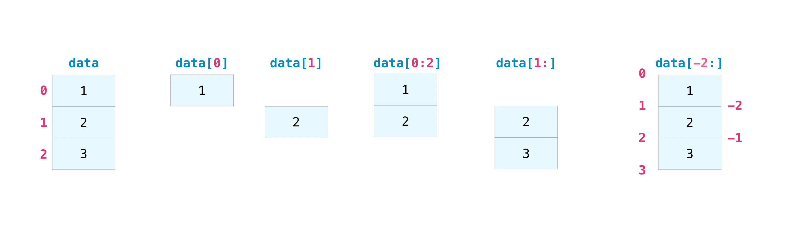
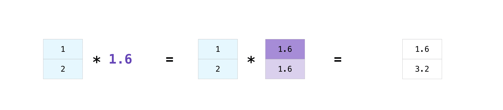

****************************************
NumPy: The Absolute Basics for Beginners
****************************************

This is a working outline for a future section introducing NumPy to absolute beginners. If you have comments or suggestions, please don’t hesitate to reach out!

- How to install NumPy
  
  - various operating systems 

  - If you don't have Python yet, consider using Anaconda as the easiest way to get started

    - The good thing about getting this Python distribution is is the fact that you don’t need to worry too much about separately installing NumPy or any of the major packages that you’ll be using for your data analyses, such as pandas, Scikit-Learn, etc.
    
    - If you do have Python, you can install NumPy with `conda install numpy` or `pip install numpy`
    
    - For more details, see the `Installation` section

- How to import NumPy

::

  import numpy as np 

(We shorten "numpy" to "np" in order to save time and also so that code is standardized so that anyone working with your code can easily understand and run it.)

- What is an array?

  - An array is a central data structure of the NumPy library. It's a grid of values and it contains information about the raw data, how to locate an element, and how to interpret an element. It has a grid of elements that can be indexed in `various ways <https://numpy.org/devdocs/user/quickstart.html#indexing-slicing-and-iterating>`_. The elements are all of the same type, referred to as the array `dtype`. 

  All of the values in an array should be the same type. An array can be indexed by a tuple of nonnegative integers, by booleans, by another array, or by integers. The **rank** of the array is the number of dimensions. The **shape** of the array is a tuple of integers giving the size of the array along each dimension.

  - One way we can initialize NumPy arrays is from nested Python lists. 

  - We can access the elements in the array using square brackets.

    - When you're accessing elements, remember that indexing starts at 0. That means that, if you want to access the first element in your array, you'll be accessing element "0".

- To create a NumPy array, you can use the function `np.array()`

  - All you need to do to create a simple array is pass a list to it. If you choose to, you can also specify the type of data in your list. You can find more information about data types `here <https://numpy.org/devdocs/user/quickstart.html#arrays-dtypes>`_.

.. image:: images/np_array.png
    :width: 100%

::

    import numpy as np

    # create a 1-D array
    a = np.array([1,2,3])

    # print the first element of the array
    print(a[0])
    # this will print 1

 
- More information about arrays

  - What else might it be called?

    - You might occasionally hear an array referred to as an "ndarray," which is shorthand for "N-dimensional array." You might also hear **1-D**, or one-dimensional array, **2-D**, or two-dimensional array, and so on. The numpy `ndarray` class is used to represent both matrices and vectors. A vector is an array with a single column, while a matrix referrs to an array with multiple columns.

  - What are the attributes of an array?

  - How do you know the shape and size of an array?

    - **ndarray.ndim** will tell you the number of axes, or dimensions, of the array.

    - **ndarray.shape** will display a tuple of integers that indicate the number of elements stored along each dimension of the array. If, for example, you have a 2D-array with 2 rows and 3 columns, the shape of your array is (2,3).

    - **ndarray.size** will tell you the total number of elements of the array. This is, in other words, the product of the elements of the array's shape.

    - For example:

::

      import numpy as np
      array_example = np.array([[[0, 1, 2, 3]
                                 [4, 5, 6, 7]],

                                 [[0, 1, 2, 3]
                                  [4, 5, 6, 7]],

                                  [0 ,1 ,2, 3]
                                  [4, 5, 6, 7]]])
      array_example.ndim
      # will return 3
      
      array_example.shape
      # will return (3,2,4)
      
      array_example.size
      # will return 24

- Can you reshape an array?

- What’s the difference between a Python List and a NumPy array? 

  - Why use NumPy?

- Broadcasting example

- How to create an array (ndarray object)
- How to create a basic array
- How to create an array from existing data

  - reading in a CSV

::

  import pandas as pd

  # if all columns are the same type
  x = pd.read_csv('filename.csv').values

  # otherwise, select the columns you need
  x = pd.read_csv('filename.csv', columns=['float_colname_1', ...]).values

- How to create a new array from an existing array
- How to specify the datatype
  
  - Examples of commonly used NumPy dtypes

- How to inspect the size and shape of a NumPy array
- How to check whether a list is empty or not
- How to represent missing values and infinite values
- Indexing and Slicing

We can index and slice NumPy arrays in the same ways we can slice Python lists:

- Basic array operations(np.sum, np.dot)

  - Operations on a single array

  - Unary operators

  - Binary operators

  - Once you've created your arrays, you can start to work with them. For example, if you create two arrays, one called "data" and one called "ones" 

.. image:: images/np_array_data_ones.png

you can simply add them together by using the plus sign.

.. image:: images/np_data_plus_ones.png
    :width: 100%

Of course, you can do more than just addition!

.. image:: images/np_sub_mult_divide.png
    :width: 100%

There are often times when you might want to carry out an operation between an array and a single number (also known as an operation between a vector and a scalar). For example, you may our "data" array contains information about distance in miles and you want to convert it to kilometers. We can perform this operatioin with `data * 1.6`

NumPy understood that the multiiplication should happen with each cell. That extremely useful concept is called *broadcasting*.

- How to compute mean, median, minimum, maximum, std, var

NumPy also gives us aggregations functiions. In addition to `min`,  max`, and `sum`, you can easily run `mean` to get the average, `prod` to get the relut of multiplying the elements together, `std` to get the standard deviation, and many more.

.. image:: images/np_aggregation.png
  
  - (include row-wise and column-wise compute)

- Sorting an array

- How to concatenate two arrays
  
  - column-wise

- row-wise

  - np.concatenate, np.stack, np.vstack, np.hstack

- How to sort an array 
  
  - based on one (or more) columns
    
    - np.sort
    
    - np.argsort

    - np.argmin

    - np.argsort

  - based on two or more columns
    
    - np.lexsort

- How to pass a list of lists to create a 2-D array

- Creating Matrices

  - You can pass Python lists of lists to create a matrix to represent them in NumPy.

  `np.array([[1,2],[3,4]])`

  Once you've created your matrices, you can add and multiply them using aarithmetic operators if you have two matrices that are the same size.

  .. image:: images/np_matrix_arithmetic.png

You can do these arithmetic operations on matrices of different sizes, but only if the different matrix has only one column or onw row. In this case, NumPy will use its broadcast rules for the operation.

.. image:: images/np_matrix_broadcasting.png

- How to extract specific items from an array
- How to create sequences, repetitions, and random numbers
 
  There are often instances where we want NumPy to iinitialize the values of an array for us. NumPy offers methods like ones(), zeros() and random.random() for these instances. All you need to do is pass in the number of elements you want it to generate.

  .. image:: images/np_ones_zeros_random.png

  - np.linspace
  
  - np.logspace

  - np.tile
  
  - np.zeros

  - np.ones

- Random Number Generation (update below to numpy.random.Generator)

  - np.random.randn
  
  - np.random.randint
  
  - np.random.random
  
  - np.random.choice
  
  - np.random.RandomState, np.random.seed

  - You can also use the `ones()`, `zeros()`, and `random()` methods to create a matrix if you give them a tuple describing the deminsions of the matrix.

- How to get the unique items and the counts
- How to get index locations that satisfy a given condition 
- How to reverse
 
  - How to reverse the rows
 
  - How to reverse the whole array

- Reshaping and Flattening multidimensional arrays
  
  - flatten vs ravel

- How to import and export data as a CSV
- How to save and load NumPy objects
- How to apply a function column-wise or row-wise
- How to convert a 1D array into a 2D array (how to add a new axis)
- How to plot arrays, very basic with Matplotlib
- How to read a docstring with `?` and source code with `??` in IPython/Jupyter

- More useful functions:

  - np.clip
  
  - np.digitize
  
  - np.bincount
  
  - np.histogram

-------------------------------------------------------

*Image credits: Jay Alammar http://jalammar.github.io/*

